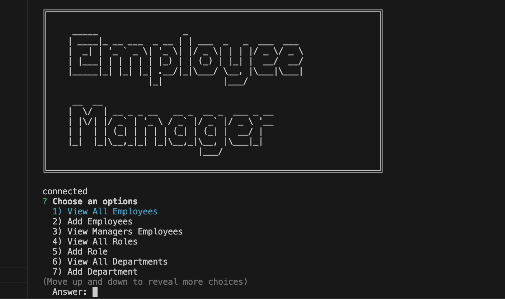

# employee-tracker

## Description 
The application start by running node and it will pop up the prompts of what role, department, and employees. It allows the access to see there id and salaries as well

## Installations 
Use of npm y -init, npm inquier, npm mysql

## Video 
Demonstration of employee tracker.
Watch a [video](https://watch.screencastify.com/v/FdY5Hwk0z66jGQWfv5cM) demonstration of the basic functionality:

